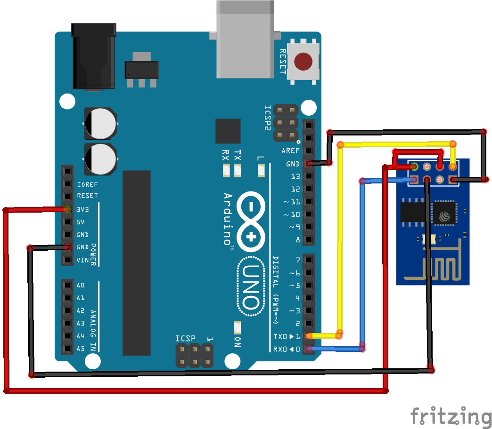
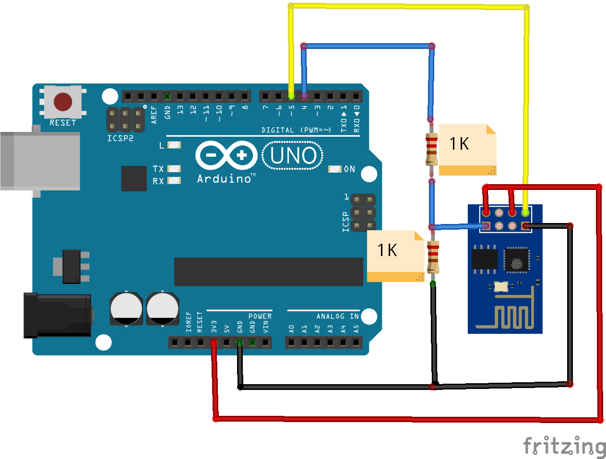

# Flash-firmware---ESP-01

#STEP-1
-->Do the following connection without ATMEGA328 IC and connect the arduino uno with your laptop/pc

#STEP-2
-->Download ESP8266 Flasher and firmware
-->Install and open the flasher select the the firmware.bin file
-->Check your COM port and change it
-->Now Flash it by clicking download button in the ESP8266 flasher

#STEP-3
-->Once the flashing over remove the connection and follow the below circuit , connect the arduino uno with your laptop
**NOTE:WITH ATMEGA328 IC**

#STEP-4
--Set the baud rate by uploading the arduino code 

